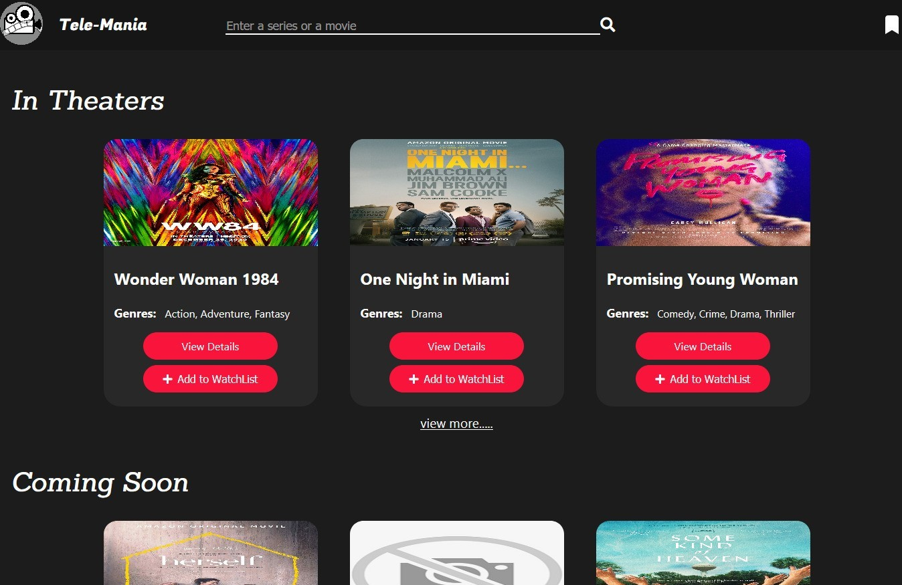

# Tele-Mania

### *Tele-Mania* is a movie database which provides each and every thing related to a movie or a series plus it also gives information of  currently streaming movies coming soon movies and much more.
## Built with
   - ### React 
   - ### React-Router-Dom
   - ### React Context API
   - ### Imdb API

## How to use

### You can open the details of any movie or series by simply clicking on the card of that item or by clicking **View Details** button. If you want to check more stuff of a particular section e.g *Coming Soon*, simply press **view more** button 

  
 
 

### You can also search your favorite movies and series plus You can add them on your watch list too. To open/view your saved watch list simply click on the top right button of the navigation bar.  

  
 
 

 ### You can also view details of the actor of a movie by simply clicking on its Avatar.

## 👨‍💻 Author

### Yo👋 it's Meer, an aspiring react developer and an undergrad student. 
 

## Contact 
- [Connect on LinkedIn](https://www.linkedin.com/in/meerhamza1421/)
- [Follow on twitter](twitter.com/meerHamza1421)
- [hamzababar37@gmail.com](hamzababar37@gmail.com)
