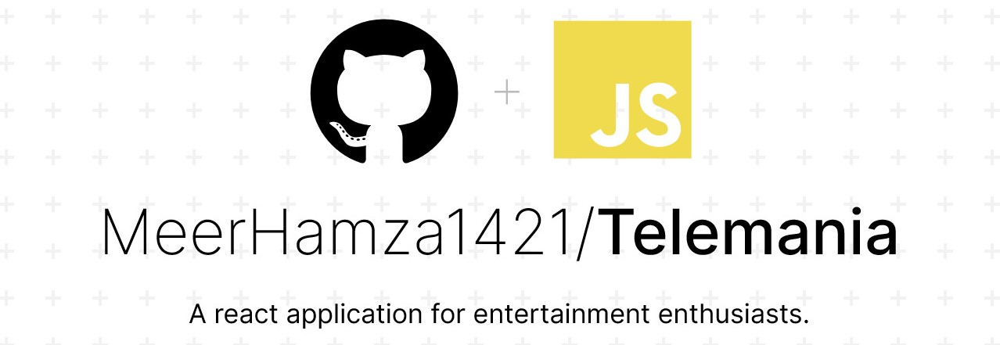

### *Tele-Mania* is an application for entertainment enthusiasts which provides each and every thing related to a movie or a series plus it also gives information of  currently streaming movies coming soon movies and much more.

## ⚡ Stack
   -  React 
   -  SCSS
   -  Imdb API

## 👨‍💻 Author

Yo👋 it's Meer, a full stack developer and a Jr. Year CS undergrad. 

 
&nbsp;
&nbsp;
&nbsp;

# Hactoberfest-2021

### Hactoberfest-2021
#Hactoberfest

#hactoberfest

@hactoberfest 

@Hactoberfest 

#hactoberfest

@hactoberfest

# Hactoberfest

# My First Hactoberfest.😊

##  Program

`#include<iostream>`
`using namespace std;`
`Int main()`

## How do I get started?
1. Visit the official HactoberFest website [here](https://hacktoberfest.digitalocean.com/)
3. Login using your Github/ Gitlab account. It is crucial that you have a Github or Gitlab account to take part in Hactoberfest.
4. Done
## Your next step!
Logging in through your Github/Gitlab account allows Hacktoberfest to track your progress. You are required to:
